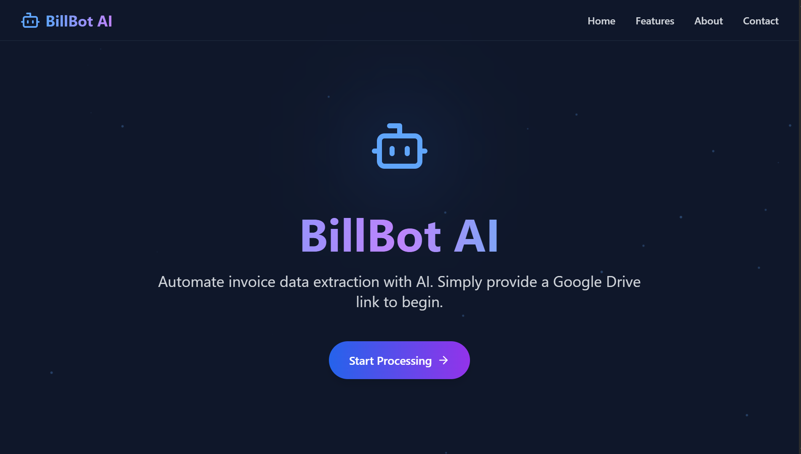
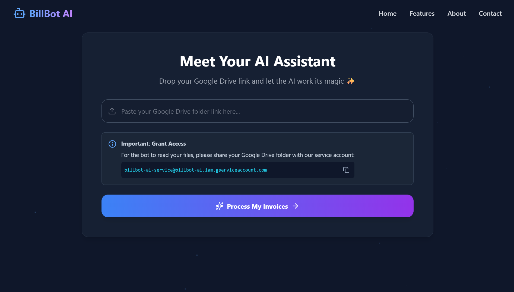

# 📑 BillBot AI: Intelligent Invoice Processing with Multi-Agent Automation

**BillBot AI** is an advanced automation tool engineered to revolutionize invoice processing. By deploying a sophisticated multi-agent system powered by **Google's Gemini LLM**, it seamlessly extracts, structures, and analyzes data from a multitude of invoice formats, including PDFs and images.  
The final, clean data is delivered in a user-friendly **Excel format**, complete with automated currency conversions.

This solution is crafted for organizations and individuals aiming to eradicate tedious manual data entry, minimize costly errors, and reclaim valuable time.

---

## 🚨 Why BillBot AI?

Manual invoice management is a significant bottleneck for modern businesses.  
It’s inefficient, prone to human error, and unable to scale effectively.  

### Core Challenges:
- **Time-Consuming Data Entry**: Repetitive and drains productivity.  
- **High Probability of Errors**: Typos, omissions → inaccurate records, delays, compliance issues.  
- **Diverse & Inconsistent Formats**: Different layouts (PDF, JPG, PNG) → hard to standardize.  

---

## ✅ How BillBot AI Solves This

- 🤖 **Fully Automated Data Extraction**: AI reads invoices like a human, extracting fields (invoice number, vendor, totals, etc.).  
- 📂 **Universal Format Compatibility**: Works with text-based PDFs and images.  
- 🧠 **Collaborative AI Agents**: Specialized agents handle retrieval → parsing → LLM analysis → Excel generation.  
- 📊 **Structured & Actionable Output**: Outputs clean, ready-to-use Excel files.  

---

## 📸 Screenshots





---

## 🛠️ Tech Stack

### 🌐 Frontend
- **React** – UI components  
- **Vite** – Lightning-fast dev/build tool  
- **Tailwind CSS** – Utility-first styling  
- **Framer Motion** – Animations & interactions  
- **Lucide React** – Icon set  

### 🔗 Backend
- **Flask** – Python web framework (APIs)  
- **LangChain** – Multi-agent LLM orchestration  
- **Google Gemini** – LLM for extraction & analysis  
- **Pandas** – Excel file generation & manipulation  
- **PyDrive2** – Google Drive API wrapper  
<!-- - **Tenacity** – Retry logic for robust operations   -->

---

## 🏗️ Multi-Agent Architecture

BillBot AI’s strength = **distributed, multi-agent system**.  
Each agent = a specialized automated worker, coordinated by an **orchestrator**.

- **Drive Agent** → Connects to Google Drive, inventories & downloads files.  
- **Parser Agent** → Extracts text (pdfplumber for PDFs, Cloud Vision OCR for images).  
- **LLM Agent** → Uses Gemini via LangChain → extracts & structures fields into JSON, handles currency conversion.  
- **Excel Agent** → Converts JSON → Excel with Pandas.  
- **Orchestrator** → Manages workflow, passes data, handles errors.  

---

## 📡 API Reference

### ▶️ Process Invoices
**POST** `/api/process-invoices`  
Triggers full invoice-processing workflow.

#### Request Body:
```json
{
  "drive_link": "https://drive.google.com/drive/folders/YOUR_FOLDER_ID"
}
```

#### Responses:
- `200 OK` → Returns `Invoices_Processed.xlsx`  
- `400 Bad Request` → Missing/invalid `drive_link`  
- `500 Internal Server Error` → Processing failure (error message in JSON)  

---

## 🧪 Getting Started

### 📦 Prerequisites
- Python **3.8+**  
- Node.js **v18+** (with npm)  
- Google Cloud SDK installed & configured  
- Google Cloud Project with:  
  - Drive API enabled  
  - Vision API enabled  
- Currency Conversion API key (e.g., currencyapi.com)  

---

### 🚀 Installation

**Clone the Repo**
```bash
git clone https://github.com/Sudhanshu-NITR/BillBot_AI.git
cd BillBot_AI
```

**Backend Setup**
```bash
cd backend
pip install -r requirements.txt
```

**Frontend Setup**
```bash
cd ../frontend
npm install
```

---

### 🔐 Environment Variables

Create **`backend/.env`**:
```env
# Google Gemini API Key
GOOGLE_API_KEY="YOUR_GEMINI_API_KEY"

# Currency Conversion API Key
CURRENCY_API_KEY="YOUR_CURRENCY_API_KEY"

# Google Cloud Service Account Credentials (minified JSON)
SERVICE_ACCOUNT_CREDENTIALS='{"type": "service_account", "project_id": "..."}'
```

Create **`frontend/.env`**:
```env
VITE_API_BASE_URL=http://127.0.0.1:5000
```

---

### 🧑‍💻 Running the Application

**Start Backend (Flask)**
```bash
cd backend
flask run
```

**Start Frontend (Vite)**
```bash
cd frontend
npm run dev
```

App will be available at → [http://localhost:5173](http://localhost:5173)

---

## 🌱 Future Scope
- 📊 **Dashboard & Analytics** – History, stats, insights  
- 📂 **Multi-File Upload** – Direct local uploads  
- 🔗 **Webhook Integration** – QuickBooks, Xero, etc.  
- ✅ **Advanced Validation** – AI-driven fraud/error detection  
- 🌍 **Multi-Language Support** – Process invoices in multiple languages  

---

